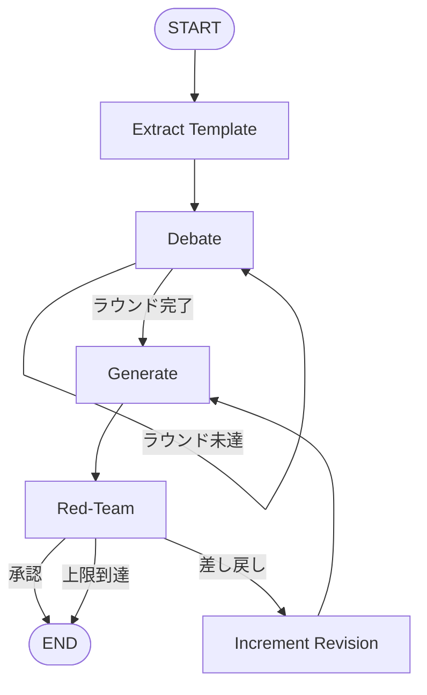

# 機械学習実験自動更新マルチエージェント Agent — 技術ドキュメント

本ドキュメントは，本リポジトリ（Experiment Agent）の**使用方法**と**技術概念**をまとめたものである．
要件の詳細は `root_order_001.md` 〜 `root_order_003.md` を参照すること．

---

## 1. システム概要

本システムは，過去の実験指示書（`order_{k}.md`）と結果報告書（`report_{k}.md`）の履歴を読み込み，マルチエージェント・ディベート（MAD）とレッドチーミング（敵対的レビュー）を経て，次期実験指示書 `order_{k+1}.md` を自動生成する．

- **基盤 LLM:** Gemini API（`langchain-google-genai`）
- **オーケストレーション:** LangGraph
- **配置想定:** 親の実験リポジトリ内の Git サブモジュールとして配置し，親リポジトリから実行する

機械学習プログラム自体の作成規約は `cursor_template/` 側のプロンプトが担う．本 Agent が生成する `order_{k}.md` には**実験固有の指示のみ**を書き，テンプレートと重複する一般事項（Docstring 義務，`train.ipynb` 配置規則など）は含めない．

---

## 2. 要件適合状況

### 2.1. root_order_001.md（要件定義）

| 要件 | 実装 |
|:---|:---|
| order/report 履歴の自動検出・時系列読み込み | `src/history.py` |
| 親リポジトリ対応のパス引数 | CLI の `order_dir`, `report_dir`, `log_dir`, `template_dir` |
| `tokens.json` から Gemini API キー読み込み | `src/config.py` |
| MAD（DS / ML エンジニア，最大 N ラウンド） | `src/graph.py` の Debate ノード（既定 3 ラウンド） |
| レッドチーム批評・差し戻しループ | `src/graph.py` の Red-Team ノード（既定最大 2 回） |
| Extract Template → Debate → Generate → Red-Team | LangGraph ワークフロー |
| ディベート要約の State 蓄積 | `State.debate_summaries` |
| Pydantic 構造化出力 | `src/schemas.py`（`OrderDraft`, `RedTeamReview` 等） |
| レートリミット対策（リトライ・スリープ） | `src/config.py` |
| 親ディレクトリ名のハードコーディング禁止 | 全パスを CLI 引数で受け取る |
| `log_{k+1}.md` 出力 | `log_dir` へ書き出し |

### 2.2. root_order_002.md（追加要件）

| 要件 | 実装 |
|:---|:---|
| `cursor_template` と重複する内容を order に含めない | Extract Template ノード + `exclusion_guide` + Generate/Red-Team プロンプト |
| 会話ログを Markdown で出力 | `src/log_format.py` → `log_{n+1}.md` |

### 2.3. root_order_003.md（配置仕様）

| 要件 | 実装 |
|:---|:---|
| `order_dir`, `report_dir`, `log_dir`, `template_dir` を引数に | `run_agent.py` の 4 位置引数 |
| ソースを `src/` に配置 | `Experiment_Agent_v2/src/` |
| `run_agent.py` をリポジトリ直下に配置 | 準拠 |

---

## 3. 使用方法

### 3.1. セットアップ

```bash
pip install -r requirements.txt
cp tokens.json.example tokens.json
# tokens.json の "gemini" に API キーを設定
```

### 3.2. 入力ファイルの配置

親リポジトリに，時系列順で以下を配置する（ディレクトリは実行時引数で指定）．

| ディレクトリ / ファイル | 説明 |
|:---|:---|
| `orders/order_000.md`, … | 各回の実験指示書 |
| `reports/report_000.md`, … | 各回の実験結果報告書 |
| `cursor_template/` | 実験プログラム作成用テンプレート |
| `logs/` | エージェント会話ログの出力先（**無ければ自動作成**） |

ファイル名は `order_{番号}.md` / `report_{番号}.md` / `log_{番号}.md` 形式（番号はゼロ埋め可）．

**履歴として読み込まれるのは order と report の両方が存在する番号のみ．** report のない order は警告を出してスキップする．

### 3.3. 実行

```bash
python3 run_agent.py <order_dir> <report_dir> <log_dir> <template_dir>
```

**例（親リポジトリから）:**

```bash
python3 Experiment_Agent_v2/run_agent.py orders reports logs cursor_template
```

**例（本リポジトリ内デバッグ）:**

```bash
python3 run_agent.py orders reports logs /path/to/cursor_template
```

### 3.4. CLI オプション

| オプション | 既定値 | 説明 |
|:---|:---|:---|
| `order_dir` | （必須） | `order_*.md` の読み込み・出力先 |
| `report_dir` | （必須） | `report_*.md` の読み込み先 |
| `log_dir` | （必須） | `log_*.md` の出力先（無ければ自動作成） |
| `template_dir` | （必須） | 親リポジトリ上の cursor_template |
| `--tokens-path` | 本リポジトリの `tokens.json` | API キーファイル |
| `--max-debate-rounds` | `3` | ディベートの最大ラウンド数 |
| `--max-revisions` | `2` | レッドチーム差し戻しの最大回数 |
| `--model` | `gemini-3.5-flash` | 使用する Gemini モデル名 |
| `--stdout-only` | オフ | ファイル書き込みを行わず標準出力のみ |
| `--force` | オフ | 既存の `order_*.md` / `log_*.md` を上書き |
| `--quiet` | オフ | ノード完了の進捗表示を抑制 |

### 3.5. 出力

| ファイル | 出力先 | 説明 |
|:---|:---|:---|
| `order_{n+1}.md` | `order_dir` | 次期実験指示書（レッドチーム承認後） |
| `log_{n+1}.md` | `log_dir` | 各エージェントの会話ログ（Markdown 形式） |

`order_{k}.md` の形式は先頭行にテンプレート参照行を置き，本文は実験固有の指示のみとする．

---

## 4. 技術概念

### 4.1. マルチエージェント・ディベート（MAD）

2 つの専門エージェントが過去履歴を分析し，次期実験プランについて議論する．

| エージェント | 役割 |
|:---|:---|
| データサイエンティスト | 精度，過学習，評価指標，アルゴリズム選定の観点 |
| ML エンジニア | 計算コスト，実装の現実性，パイプラインの単純さの観点 |

各ラウンドで双方の意見を出した後，ファシリテーター LLM が合意要約を作成する．要約は `State.debate_summaries` に蓄積され，トークン消費を抑える．

### 4.2. レッドチーミング（敵対的レビュー）

ディベートに参加していない独立した批評家エージェントが，生成された `order` ドラフトを検証する．

- 前回のボトルネックが論理的に解消されているか
- Cursor が実装できる具体性があるか
- `cursor_template`（`root_prompt.md`, `machine_learning_prompt.md` 等）と重複する一般指示が混入していないか

不合格かつ差し戻し上限未満の場合，`Generate` ノードへ修正指示付きで戻す．上限到達時はその時点のドラフトを強制出力する．

### 4.3. テンプレート重要事項の抽出

`cursor_template` は**親リポジトリ**に配置される（本サブモジュール内には含めない）．
実行時の `template_dir` 引数でパスを指定する．

1. `template_guard.py` が `cursor_template/` 以下の **全 `.md` ファイルを再帰的に読み込む**
2. **Extract Template ノード**（Debate の前）が LLM で重要事項だけを抽出し，`State.template_essentials` に格納する
3. 以降の Debate / Generate / Red-Team は全文ではなく **抽出済みの重要事項**のみを参照する

| エージェント | 参照する情報 |
|:---|:---|
| Extract Template | 全 `.md` 全文（入力のみ） |
| Debate / Generate / Red-Team | `template_essentials`（抽出結果） |

### 4.4. LangGraph ワークフロー



### 4.5. State（共有状態）

`AgentState`（`graph.py`）がワークフロー全体の状態を保持する．主要フィールド:

| フィールド | 説明 |
|:---|:---|
| `history` / `history_text` | 読み込んだ実験履歴 |
| `template_context` | 全 `.md` 結合テキスト（Extract ノードの入力） |
| `template_files` | 読み込んだ `.md` の相対パス一覧 |
| `template_essentials` | Extract ノードが抽出した重要事項 |
| `exclusion_guide` | order 生成用（`template_essentials` から生成） |
| `debate_summaries` | ディベート各ラウンドの要約 |
| `final_plan` | ディベート後の次期実験プラン |
| `order_draft` | 生成中の指示書 Markdown |
| `red_team_review` | レッドチームの構造化レビュー結果 |
| `revision_count` | 差し戻し回数カウンタ |
| `agent_logs` | ログ出力用の生データ |

### 4.6. レートリミット対策

無料プランの Gemini API を想定し，`config.py` で以下を実施する．

- LLM 呼び出し失敗時の指数バックオフ付きリトライ（最大 3 回）
- エージェント連続呼び出し間のスリープ（`DEFAULT_AGENT_DELAY_SEC = 2.0`）

---

## 5. モジュール構成

```text
Experiment_Agent_v2/
├── run_agent.py              # CLI エントリポイント
├── tokens.json               # Gemini API キー（git 管理外）
├── requirements.txt
├── document.md               # 本ドキュメント
└── src/
    ├── config.py             # API 認証，LLM 生成，リトライ
    ├── history.py            # order/report の検出・読み込み
    ├── prompts.py            # 各エージェントのシステムプロンプト
    ├── schemas.py            # Pydantic 構造化出力スキーマ
    ├── graph.py              # LangGraph ワークフロー定義
    ├── template_guard.py     # テンプレート再帰読み込み・重要事項整形
    ├── log_format.py         # 会話ログの Markdown 整形
    ├── progress.py           # 進捗表示
    └── setup_check.py        # 実行前チェック（テンプレート・上書き・log_dir 作成）
```

### 5.1. モジュール間の関係

```mermaid
flowchart LR
    run_agent[run_agent.py] --> history[history.py]
    run_agent --> setup[setup_check.py]
    run_agent --> graph[graph.py]
    graph --> config[config.py]
    graph --> prompts[prompts.py]
    graph --> schemas[schemas.py]
    graph --> template_guard[template_guard.py]
    graph --> log_format[log_format.py]
    config --> tokens[(tokens.json)]
    history --> order_dir[(order_*.md)]
    history --> report_dir[(report_*.md)]
    setup --> log_dir[(log_*.md)]
    graph --> output_order[(order_{n+1}.md)]
    graph --> output_log[(log_{n+1}.md)]
```

### 5.2. 各モジュールの責務

| モジュール | 責務 |
|:---|:---|
| `run_agent.py` | 引数パース，履歴読み込み，グラフ実行，ファイル出力 |
| `history.py` | `order_(\d+).md` / `report_(\d+).md` の検出，時系列コンテキスト整形 |
| `config.py` | `tokens.json` から API キー読み込み，`ChatGoogleGenerativeAI` 初期化 |
| `prompts.py` | エージェント別システムプロンプトとユーザープロンプト組み立て |
| `schemas.py` | `OrderDraft`，`RedTeamReview` 等の Pydantic モデル |
| `graph.py` | Extract Template / Debate / Generate / Red-Team ノードと条件分岐エッジ |
| `template_guard.py` | `.md` 再帰収集，重要事項セクション組み立て |
| `log_format.py` | `agent_logs` を読みやすい Markdown に変換 |
| `setup_check.py` | テンプレート検証，出力上書き防止，`log_dir` 自動作成 |
| `progress.py` | ノード完了時の所要時間表示 |

---

## 6. 処理の流れ（実行時）

1. `run_agent.py` が `order_dir` / `report_dir` から `order_*.md` / `report_*.md` を昇順で読み込む
2. `template_dir` の存在と `.md` ファイルを検証する
3. ファイル書き込みモードの場合，`log_dir` を存在しなければ作成し，出力ファイルの上書き可否を確認する
4. LangGraph が以下を順に実行する
   - **Extract Template:** 全 `.md` から重要事項を抽出 → `template_essentials`
   - **Debate:** DS / ML エンジニアが議論 → 合意要約 → 最終プラン
   - **Generate:** 合意プランから `OrderDraft` を構造化生成 → Markdown 化
   - **Red-Team:** ドラフトをレビュー → 承認 or 差し戻し
5. 承認（または上限到達）後，`order_{n+1}.md` を `order_dir` に，`log_{n+1}.md` を `log_dir` に書き出す

---

## 7. 関連ドキュメント

| ファイル | 内容 |
|:---|:---|
| `README.md` | 概要とクイックスタート |
| `root_order_001.md` | 本システムの要件定義書 |
| `root_order_002.md` | テンプレート重複排除・ログ Markdown 化の追加要件 |
| `root_order_003.md` | ディレクトリ引数・リポジトリ配置仕様 |
| `cursor_template/root_prompt.md` | 実験プログラム作成時の共通指示（親リポジトリ側） |
| `cursor_template/prompts/machine_learning_prompt.md` | 機械学習実験の詳細規約（親リポジトリ側） |
